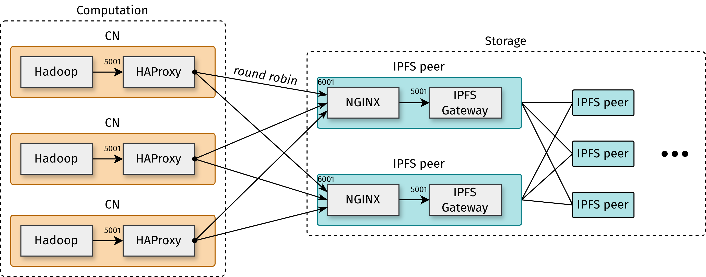

# Deployment

Let us consider a deployment composed of a set of compute nodes and a set of storage nodes running IPFS, as illustrated below.

<p align="center">
    
</p>

A local `HAProxy` instance is deployed on every compute node. Hadoop applications communicate exclusively with `localhost:5001`, while HAProxy transparently distributes requests across the available storage nodes on port `6001` using a round-robin policy.

Each storage node runs an `NGINX` reverse proxy listening on port `6001`. NGINX forwards incoming requests to the local IPFS HTTP Gateway (`127.0.0.1:5001`), which then interacts with the IPFS network.

This architecture allows Hadoop applications to access the IPFS HTTP API transparently, without requiring any knowledge of the underlying storage infrastructure.

## NGINX configuration

On every storage node that will receive requests from the compute cluster, create the file `/etc/nginx/sites-enabled/ipfs-gateway` with the following content :

```
server {
        listen 6001;
        server_name $hostname;

        location / {
                proxy_pass http://127.0.0.1:5001/;

                proxy_connect_timeout 10s;
                proxy_send_timeout 60s;
                proxy_read_timeout 60s;
        }
}
```

Reload NGINX to apply the new configuration:

```shell
sudo nginx -s reload
```

Verify that NGINX is listening correctly by running:

```
curl -X POST http://<hostname>:6001/api/v0/version
```
Replace `<hostname>` with the hostname of each IPFS gateway.

If the configuration is correct, the command should return the version information of the IPFS gateways.

## HAProxy configuration

On each computing node, set the content of the file `/etc/haproxy/haproxy.cfg` to the following :

```
global
    daemon
    maxconn 4096
    log /dev/log local0

defaults
    mode http
    log global
    option httplog
    timeout connect 10s
    timeout client 60s
    timeout server 60s

frontend http-in
    bind 127.0.0.1:5001
    default_backend ipfs-gateways

backend ipfs-gateways
    balance roundrobin
    server <gateway0> :6001 maxconn 32
    server <gateway1> :6001 maxconn 32
    ...
```
Replace `<gateway0>`, `<gateway1>`, and the remaining server entries with the hostname of each storage node running NGINX.

Once the configuration file has been created, start HAProxy:

```shell
haproxy -f /etc/haproxy/haproxy.cfg -D -p /run/haproxy/haproxy.pid
```

You can verify that HAProxy is listening correctly by running the following command on each computing node:

```
curl -X POST http://localhost:5001/api/v0/version
```

If the configuration is correct, the command should return the version information of the IPFS gateways. For example :

```shell
{"Version":"0.42.0","Commit":"969853d96","Repo":"18","System":"amd64/linux","Golang":"go1.26.4"}

```

## Verifying the deployment

Once HAProxy and NGINX have been configured on all nodes, verify that requests can successfully reach the IPFS gateways.

From any compute node, execute:

```shell
curl -X POST http://localhost:5001/api/v0/version
```

Use `journalctl -f` to monitor requests and run the previous command several times to check that all IPFS nodes are being queried.

