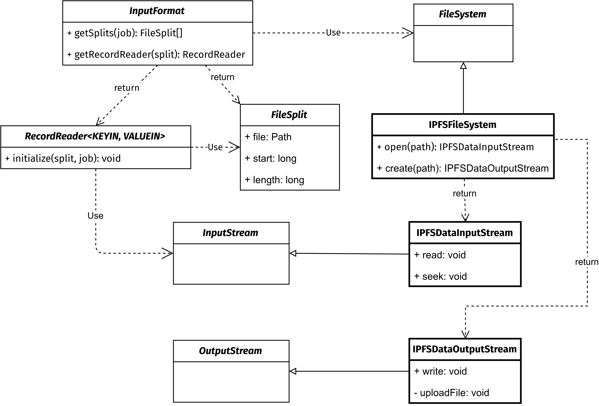

# Design

Hadoop decouples file splits and records from the underlying filesystem. When a job is launched, an `InputFormat` generates logical input splits from the job configuration. The job configuration contains information about the input files, including their URIs. Hadoop uses each URI’s [scheme](https://www.boost.org/doc/libs/latest/doc/antora/url/_images/PartsDiagram.svg) to select and instantiate the appropriate filesystem implementation, then each split creates a `RecordReader` to produce key–value pairs from the input data. The `RecordReader` accesses the data through an `InputStream` obtained by invoking the `open()` method of the filesystem instance.

To integrate IPFS on Hadoop we therefore implemented three classes : `IPFSFileSystem`, `IPFSDataInputStream`, and `IPFSDataOutputStream`. We used [java-ipfs-api](https://github.com/ipfs-shipyard/java-ipfs-http-client) to interact with IPFS.

    

## IPFSFileSystem

`IPFSFileSystem` extends `FileSystem` and implements the following basic filesystem operations :
- `open` : create and returns an `IPFSDataInputStream` to read file content
- `create` : create and returns an `IPFSDataOutputStream` to write data to a file
- `rename` : rename a file
- `delete` : delete a file
- `listStatus` : list the contents of a directory
- `setWorkingDirectory` : set the current working directory
- `getWorkingDirectory` : get the current working directory
- `mkdirs` : create directories
- `getFileStatus` : get file information (`size`, `type`, `path`)

## IPFSDataInputStream

`IPFSDataInputStream` extends `InputStream` and implements `read` and `seek` operations using IPFS API functions.

## IPFSDataOutputStream

`IPFSDataInputStream` extends `OutputStream` and implements `write` operation. Due to the immutable nature of IPFS, this component does not stream data directly to IPFS. Instead, it writes data to a temporary file, and once the write operation is complete (when the `close()` function is called), it pushes the file to IPFS using the `ipfs.add()` function from the IPFS API. After that, it stores the [CID](https://docs.ipfs.tech/concepts/content-addressing/) of the file in the folder `/_cids.out` of the default filesystem.